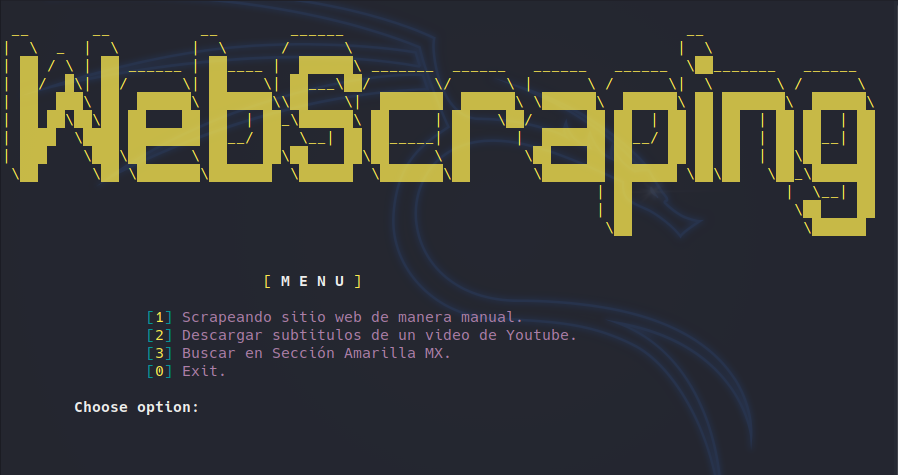

# WebScraping

<p align="center">
┏┓┏┓┏┓━━━━┏┓━━┏━━━┓━━━━━━━━━━━━━━━━━━━━━━━━━━
┃┃┃┃┃┃━━━━┃┃━━┃┏━┓┃━━━━━━━━━━━━━━━━━━━━━━━━━━
┃┃┃┃┃┃┏━━┓┃┗━┓┃┗━━┓┏━━┓┏━┓┏━━┓━┏━━┓┏┓┏━┓━┏━━┓
┃┗┛┗┛┃┃┏┓┃┃┏┓┃┗━━┓┃┃┏━┛┃┏┛┗━┓┃━┃┏┓┃┣┫┃┏┓┓┃┏┓┃
┗┓┏┓┏┛┃┃━┫┃┗┛┃┃┗━┛┃┃┗━┓┃┃━┃┗┛┗┓┃┗┛┃┃┃┃┃┃┃┃┗┛┃
━┗┛┗┛━┗━━┛┗━━┛┗━━━┛┗━━┛┗┛━┗━━━┛┃┏━┛┗┛┗┛┗┛┗━┓┃
━━━━━━━━━━━━━━━━━━━━━━━━━━━━━━━┃┃━━━━━━━━┏━┛┃
━━━━━━━━━━━━━━━━━━━━━━━━━━━━━━━┗┛━━━━━━━━┗━━┛
</p>

Herramienta hecha en Python para realizar webscraping.

## Instalación
```bash
git clone https://github.com/m4lal0/webScraping
cd webScraping
pip3 install -r requirements.txt
```

## Uso

<p align="center">

</p>

El script cuenta con menú de opciones para realizar webscraping
